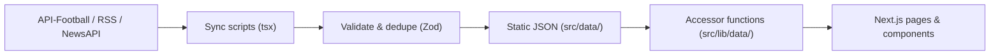

# PitchPulse

Football intelligence, all in one place. A Next.js app that aggregates
live scores, fixtures, results, transfer news, and team information from
multiple sources into a single dark-themed dashboard.

## Features

- **News** — Latest football articles and trending stories, filtered by
  category (Transfers, Premier League, Champions League, La Liga, Serie A,
  Bundesliga, Ligue 1, International Football). Articles with no source
  image fall back to a deterministic local sample photo.
- **Matches / Match Centre** — Live matches, upcoming fixtures, and recent
  results, each rendered with scores, status, and competition context.
- **Fixtures** — Browse fixtures grouped by competition and date, with
  filters for competition, team, and date range (today / tomorrow / week).
- **Transfers / Transfer Centre** — Rumours and confirmed deals, each with
  a reliability score, source, fee, and status (Rumour, Advanced,
  Negotiating, Confirmed, Completed).
- **Teams** — Per-team pages showing the club's league, country, stadium,
  capacity, upcoming matches, recent results, related news, and transfer
  activity.
- **Search** — Global search across teams, news, and transfers, with a
  debounced input, expandable result groups, and a keyboard-accessible
  modal (opened from the header).
- **Homepage** — Scroll-reveal hero, live match + latest news preview,
  feature cards, and sections for live matches, latest news, transfers,
  upcoming matches, recent results, trending stories, competitions, and
  popular teams.

## Tech Stack

- **Next.js 16.3.4** (App Router, React 19, TypeScript, Tailwind CSS v4)
- **Zod** — runtime schema validation for all data
- **date-fns** — date formatting on the fixtures page
- **framer-motion** — scroll-reveal hero animation
- **lucide-react** — icons
- **rss-parser** — RSS feed parsing during sync
- **dotenv** — environment variable loading for sync scripts

## Architecture

The app has three layers:

1. **Data sources** (`src/scripts/fetchers/`) — `football-api.ts` calls the
   API-Football REST API for live/upcoming/results matches; `rss-news.ts`
   parses RSS feeds from BBC Sport, ESPN, and The Guardian; `newsapi.ts`
   queries NewsAPI. All three are only ever executed by the sync scripts —
   they never ship to the browser.
2. **Data layer** (`src/data/*.json` + `src/lib/data/`) — Sync scripts
   fetch, deduplicate, validate (Zod), and normalise data into static JSON
   files under `src/data/`. The React app imports those JSON files
   directly; `src/lib/data/*.ts` exposes async accessor functions that run
   `validateData(schema, json)` on every read, so malformed entries are
   silently dropped rather than crashing the UI.
3. **Frontend** (`src/app/`, `src/components/`) — Client components read
   data through the accessor functions and render it with shared UI
   primitives (`src/components/ui/`).

The sync scripts (`src/scripts/`) are run manually via `tsx` outside
Next.js. They are not part of the production build.

## Data Flow

1. **Fetch** — `syncNews()` pulls RSS + NewsAPI articles; `syncMatches()`
   pulls live/upcoming/results from API-Football (seasons 2022-2024 only,
   filtered client-side because the free plan rejects date-range
   queries).
2. **Process** — Articles are deduplicated by normalised title, scored for
   trending (credibility + team relevance + image bonus + 48-hour recency),
   and mapped to the `NewsArticle` schema. Matches are normalised from the
   API's nested fixture/team/league structure into the flat `Match`
   schema. Transfers come from static JSON (`rumours.json`, `confirmed.json`).
3. **Store** — Results are written atomically (write to `.tmp`, then
   `rename`) into `src/data/news/{latest,trending}.json`,
   `src/data/matches/{live,upcoming,results}.json`,
   `src/data/transfers/{rumours,confirmed}.json`, `src/data/teams/teams.json`,
   and `src/data/competitions/competitions.json`.
4. **Display** — The app imports the JSON at build time; accessor functions
   validate on read; pages render with loading, empty, and error states.



## Project Structure

```
.
├── public/
│   └── assets/news/        # 17 sample images used as article fallbacks
├── src/
│   ├── app/                # Next.js routes (see Routes below)
│   │   ├── globals.css
│   │   ├── layout.tsx      # Root layout: BeamsBackground, Header, footer
│   │   ├── page.tsx        # Homepage
│   │   ├── news/page.tsx
│   │   ├── matches/page.tsx
│   │   ├── fixtures/page.tsx
│   │   ├── transfers/page.tsx
│   │   ├── search/page.tsx
│   │   └── teams/[teamId]/page.tsx
│   ├── components/
│   │   ├── layout/Header.tsx
│   │   ├── home/ContainerScroll.tsx
│   │   ├── matches/MatchCard.tsx
│   │   ├── news/NewsCard.tsx
│   │   ├── transfers/TransferCard.tsx
│   │   ├── teams/TeamCard.tsx
│   │   ├── search/SearchModal.tsx
│   │   └── ui/             # Image, TeamLogo, BeamsBackground,
│   │                         # GlowCard, SectionHeader, EmptyState,
│   │                         # LoadingState, ErrorState, SourceBadge,
│   │                         # DisclaimerBadge, DataFreshnessIndicator
│   ├── data/               # Generated static JSON (see Data/JSON structure)
│   ├── lib/
│   │   ├── data/           # Async accessors over src/data/*.json
│   │   ├── engine/         # Credibility, freshness, dedup, stale-data,
│   │   │                     # source registry
│   │   ├── schemas/        # Zod schemas + validateData / validateSingle
│   │   ├── constants/news-image-count.ts   # auto-generated
│   │   └── utils/          # image.ts, teams.ts
│   ├── scripts/            # Sync scripts (run via tsx, not in build)
│   │   ├── run-sync.ts     # CLI entry: news | matches | all
│   │   ├── sync-news.ts
│   │   ├── sync-matches.ts
│   │   ├── sync-all.ts
│   │   ├── fetchers/       # football-api.ts, rss-news.ts, newsapi.ts
│   │   ├── scrapers/       # Templates (not wired into sync)
│   │   ├── validators/     # Schema validation + error logging
│   │   ├── processors/     # saveToJson, dedup helpers
│   │   └── update-news-image-count.ts
│   ├── types/              # Team, Player, Competition, NewsArticle,
│   │                         # Transfer, Match, SearchResult, NewsCategory,
│   │                         # TransferStatus, MatchStatus
│   └── config/             # app-config.ts, source registries
└── scripts/strip-placeholder-images.ts
```## Routes

| Route | Page | What it does |
|---|---|---|
| `/` | `src/app/page.tsx` | Homepage: scroll-reveal hero, live match + latest news preview, feature cards, and sections for live matches, latest news, transfers, upcoming matches, recent results, trending stories, competitions, and popular teams |
| `/news` | `src/app/news/page.tsx` | Latest news grid with category filter chips, plus a trending sidebar and quick links |
| `/matches` | `src/app/matches/page.tsx` | Match Centre with Live / Upcoming / Results tabs |
| `/fixtures` | `src/app/fixtures/page.tsx` | Fixtures grouped by competition and date, with competition/team/date-range filters |
| `/transfers` | `src/app/transfers/page.tsx` | Transfer Centre with Rumours / Confirmed tabs and a status filter |
| `/search` | `src/app/search/page.tsx` | Debounced global search across teams, news, and transfers |
| `/teams/[teamId]` | `src/app/teams/[teamId]/page.tsx` | Team detail page (upcoming matches, recent results, news, transfer activity, team info) |

The header also opens a `SearchModal` (command-palette style) that runs the
same `globalSearch` query.

## Important Components and Utilities

- `NewsCard` (`src/components/news/NewsCard.tsx`) — three variants
  (`default`, `featured`, `compact`). `resolveArticleImage()` prefers the
  source image, then falls back to `localNewsImage(article.id)`.
- `MatchCard` (`src/components/matches/MatchCard.tsx`) — `default`, `live`,
  and `compact` variants; tags historical matches (older than 6 months).
- `TransferCard` (`src/components/transfers/TransferCard.tsx`) —
  `default` and `compact` variants; tags transfers older than 30 days as
  historical.
- `TeamCard` (`src/components/teams/TeamCard.tsx`) — `default`, `compact`,
  and `card` variants.
- `FallbackImage` (`src/components/ui/Image.tsx`) — renders an `` or,
  when the source is null/errored, an initials placeholder. Supports
  `fill` + `sizes` for fixed-aspect-ratio cards.
- `TeamLogo` (`src/components/ui/TeamLogo.tsx`) — logo with initials
  fallback, five sizes.
- `ContainerScroll` (`src/components/home/ContainerScroll.tsx`) —
  framer-motion scroll-reveal hero.
- `BeamsBackground` (`src/components/ui/beams-background.tsx`) — canvas
  animation, site-wide, respects `prefers-reduced-motion`.
- `GlowCard` (`src/components/ui/spotlight-card.tsx`) — mouse-tracking
  radial spotlight card.
- `resolveImageUrl` / `localNewsImage` (`src/lib/utils/image.ts`) — image
  normalisation and deterministic local-image mapping.
- `resolveTeamLogo` / `getTeamInitials` (`src/lib/utils/teams.ts`) — logo
  normalisation and fallback initials.
- `processItem` (`src/lib/engine/index.ts`) — combines credibility,
  freshness, and source-registry data into a single `ProcessedItem`
  (verification, freshness, flags, disclaimer text).

## Data / JSON Structure

All data lives under `src/data/` and is regenerated by the sync scripts.

| File | Contents |
|---|---|
| `src/data/news/latest.json` | 30 most recent articles, newest first |
| `src/data/news/trending.json` | 10 top trending articles by weighted score |
| `src/data/matches/live.json` | 8 currently live matches |
| `src/data/matches/upcoming.json` | Upcoming fixtures (currently 0 — free plan has no future fixtures) |
| `src/data/matches/results.json` | 20 most recent results |
| `src/data/teams/teams.json` | 23 teams |
| `src/data/competitions/competitions.json` | 10 competitions |
| `src/data/transfers/rumours.json` | 8 transfer rumours |
| `src/data/transfers/confirmed.json` | 8 confirmed transfers |

Core shapes (see `src/types/index.ts` and `src/lib/schemas/index.ts`):

- `NewsArticle` — `id`, `title`, `summary`, `source` (string or
  `{name, type, url, credibilityScore}`), `sourceUrl`, `image` (nullable),
  `category`, `publishedAt`, plus optional `freshness`, `verification`,
  `relatedTeams`, `relatedPlayers`, `dataStatus`.
- `Match` — `id`, `competition`, `homeTeam`, `awayTeam`, `homeScore`,
  `awayScore`, `status` (`SCHEDULED | LIVE | HALFTIME | FINISHED | POSTPONED |
  CANCELLED`), `kickoff` (ISO datetime with offset), optional `venue`,
  `referee`, `matchday`, `lastUpdated`, `freshness`, `source`.
- `Transfer` — `id`, `player`, `fromClub`, `toClub` (nullable), `status`
  (`Rumour | Advanced | Negotiating | Confirmed | Completed`), `fee`
  (nullable), `source`, `reliability` (0-100), `updatedAt`.
- `Team` — `id`, `name`, `shortName`, `logo` (nullable), `country`, `league`,
  optional `founded`, `stadium`, `capacity`.
- `Competition` — `id`, `name`, `shortName`, `logo` (nullable), `country`,
  `type` (`league | cup | international`).

## Data Sources

- **Matches** — API-Football (`v3.football.api-sports.io`, free tier:
  100 req/day, seasons 2022-2024). League IDs: Premier League 39, La Liga
  140, Bundesliga 78, Serie A 135, Ligue 1 61, Champions League 2.
- **News** — RSS feeds (BBC Sport, ESPN FC, The Guardian) via
  `rss-parser`, plus NewsAPI (`newsapi.org/v2/everything`).
- **Transfers / Teams / Competitions** — Static JSON committed to the repo
  (no live fetcher wired into sync yet).

Source credibility is tracked in `config/sources/*.json` (publications,
official clubs, journalists, official leagues) and consumed by
`src/lib/engine/source-registry.ts`.

## Environment Variables

Defined in `.env.local` (copy from `.env.local.example`). Never commit
real values — `.env` and `.env.local` are gitignored.

| Variable | Purpose | Example |
|---|---|---|
| `FOOTBALL_API_KEY` | API-Football RapidAPI key | `your_api_key_here` |
| `FOOTBALL_API_HOST` | API host (already includes version) | `api-football-v1.p.rapidapi.com` |
| `NEWS_API_KEY` | NewsAPI key | `your_newsapi_key_here` |

The app itself never reads these at runtime — they are only consumed by
the sync scripts. When either key is missing, the corresponding fetcher
logs a warning and returns an empty array, leaving the existing JSON in
place.

## Setup & Installation

```bash
npm install
cp .env.local.example .env.local   # fill in keys if you want live data
npm run dev                       # http://localhost:3000
```

TypeScript and ESLint are configured via the standard Next.js toolchain:

```bash
npm run build      # production build + type check
npm run lint       # eslint
npx tsc --noEmit   # standalone type check
```

## Available npm Commands

| Command | What it runs |
|---|---|
| `npm run dev` | `next dev` — development server |
| `npm run build` | `next build` — production build |
| `npm run start` | `next start` — production server |
| `npm run lint` | `eslint` |
| `npm run sync` | `tsx src/scripts/run-sync.ts` — sync news **and** matches |
| `npm run sync:news` | `tsx src/scripts/run-sync.ts news` — sync news only |
| `npm run sync:matches` | `tsx src/scripts/run-sync.ts matches` — sync matches only |
## How Data is Updated

Run a sync from the project root:

```bash
npm run sync            # news + matches
npm run sync:news       # news only
npm run sync:matches    # matches only
```

Each run:

- Fetches from the configured sources (skipping any fetcher whose API key
  is not set).
- Deduplicates, validates against the Zod schemas, and writes the JSON
  atomically.
- Recomputes `src/lib/constants/news-image-count.ts` from
  `public/assets/news/` so article image fallbacks stay in sync with the
  sample images on disk.

After adding or removing images in `public/assets/news/`, re-run
`npm run sync:news` (or any sync) to refresh the count.

## Deployment

The app is configured for Vercel (`vercel.json`):

```json
{
  "$schema": "https://openapi.vercel.sh/vercel.json",
  "framework": "nextjs",
  "buildCommand": "npm run build",
  "installCommand": "npm install"
}
```

To deploy:

1. Push the repo to GitHub (already on `origin/main`).
2. In the Vercel dashboard, **Import Project** → select
   `Atharva-Goud/PitchPulse`.
3. Vercel auto-detects `next.config.ts` as Next.js, runs `npm install`
   and `npm run build`, and deploys. No environment variables are needed at
   runtime — the app only reads local JSON.

## Known Limitations

- **No upcoming fixtures** — the free API-Football plan only covers seasons
  2022-2024, and the 2024 season ended in May 2025. Future fixtures cannot
  be populated until a paid plan or a different data source is added. The
  UI shows an explanatory empty state in that case.
- **Intermittent empty API responses** — the API can return 0 results,
  likely due to rate limiting. The fetcher retries with exponential
  backoff (up to 3 attempts), and the sync guards against overwriting
  existing JSON when a fetch returns nothing, so a bad run does not wipe
  good data.
- **Transfer data is static** — `rumours.json` and `confirmed.json` are
  hand-maintained; there is no live transfer feed wired into sync yet (the
  `scrapers/` templates exist but are not called).
- **No player data on team pages** — team pages show matches, news, and
  transfers, but not squad/player details.
- **News deduplication is title-based** — near-duplicate headlines with
  different wording are not merged.

## Potential Future Improvements

- Paid API-Football plan (or a different provider) to restore upcoming
  fixtures and live match coverage beyond 2024.
- Wire the `scrapers/` templates (Transfermarkt, Fabrizio Romano, etc.) into
  the sync pipeline for live transfer data.
- Add a dedicated `/teams` index page (currently teams are only reachable
  via search or the homepage's "Popular Teams" rail).
- Add team squad / player detail pages.
- Add a `/competitions/[id]` page for league standings and form tables.
- Server-side rendering of data accessors instead of client-side fetch
  on every navigation.
- Persist sync results (last-run timestamp, items found) and surface a
  data-freshness banner on pages that depend on fresh data.
- Replace the deterministic local-image fallback with AI-generated or
  context-specific imagery once a suitable source is available.

